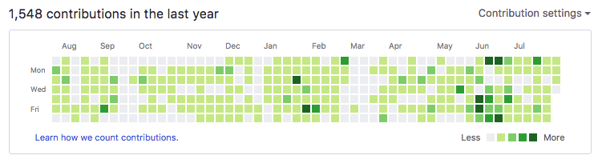

```{r setup, include=FALSE}
options(htmltools.dir.version = FALSE)
```

# Hello useR! 2019

.pull-left[
```{r, fig.align='center', fig.height=20, echo=FALSE}

```
]
.pull-right[
**Github** - brentthorne <br>
**Twitter** - brentthorne18 <br>
**Email** - brentthorne18@gmail.com <br>

**Quick Facts:**<br>
- Started using R in 2014
- Hated it!
- Realized the value in FOSS
- Taught myself R 
- Made the {posterdown} package
- Now known as the "you can do that in R!" guy in my lab!
]

---
# Hello useR! 2019

.pull-left[
```{r, fig.align='center', fig.height=20, echo=FALSE}

```
]
.pull-right[
**Github** - brentthorne <br>
**Twitter** - brentthorne18 <br>
**Email** - brentthorne18@gmail.com <br>

**Quick Facts:**<br>
- Started using R in 2014
- Hated it!
- Realized the value in FOSS
- Taught myself R 
- Made the {posterdown} package
- Now known as the "you can do that in R!" guy in my lab!
]

---
# What packages can I use?

| Grad Student's Needs | Possible R packages |
|---------|:---------------------:|
| Taking notes | [rmarkdown](https://rmarkdown.rstudio.com/)/ [pagedown](https://github.com/rstudio/pagedown) |
| Manage Citations | [rbbt](https://github.com/paleolimbot/rbbt)/ [citr](https://github.com/crsh/citr) |
| Conference Posters | [pagedown](https://github.com/rstudio/pagedown)/ [posterdown](https://github.com/brentthorne/posterdown) (_personal bias on this one_) |
| Thesis/ Dissertation  | [bookdown](https://github.com/rstudio/bookdown)/ [thesisdown](https://github.com/ismayc/thesisdown)/ [pagedown::thesis_paged](https://github.com/rstudio/pagedown#thesis-pagedownthesis_paged) |
| Slide Shows | [xaringan](https://github.com/yihui/xaringan)/ [beamer](https://bookdown.org/yihui/rmarkdown/beamer-presentation.html) |
| Make a CV | rmarkdown/ [pagedown](https://github.com/rstudio/pagedown#resume-pagedownhtml_resume) |
| Manuscripts | [rticles](https://github.com/rstudio/rticles)/ [pagedown](https://github.com/rstudio/pagedown#journal-of-statistical-software-article-pagedownjss_paged) |

---
# What packages can I use?

| Grad Student's Needs | Possible R packages |
|---------|:---------------------:|
| Taking notes | [rmarkdown](https://rmarkdown.rstudio.com/)/ [pagedown](https://github.com/rstudio/pagedown) |
| Manage Citations | [rbbt](https://github.com/paleolimbot/rbbt)/ [citr](https://github.com/crsh/citr) |
| Conference Posters | [pagedown](https://github.com/rstudio/pagedown)/ [posterdown](https://github.com/brentthorne/posterdown) (_personal bias on this one_) |
| Thesis/ Dissertation  | [bookdown](https://github.com/rstudio/bookdown)/ [thesisdown](https://github.com/ismayc/thesisdown)/ [pagedown::thesis_paged](https://github.com/rstudio/pagedown#thesis-pagedownthesis_paged) |
| Slide Shows | [xaringan](https://github.com/yihui/xaringan)/ [beamer](https://bookdown.org/yihui/rmarkdown/beamer-presentation.html) |
| Make a CV | rmarkdown/ [pagedown](https://github.com/rstudio/pagedown#resume-pagedownhtml_resume) |
| Manuscripts | [rticles](https://github.com/rstudio/rticles)/ [pagedown](https://github.com/rstudio/pagedown#journal-of-statistical-software-article-pagedownjss_paged) |

---
# New User's 

```{r, fig.align='center', out.width="100%", echo=FALSE}

```

---
# New User's 
.pull-left[
<br>
<br>

- Show them, don't tell them

- Show them only 1 item at a time

- Ask them if they want help getting started
]

.pull-right[
```{r, fig.align='center', out.width="100%", echo=FALSE}

```
]
---
# LaTeX or HTML?

```{r, fig.align='center', out.width="45%", echo=FALSE}

```

---
# LaTeX or HTML?
.pull-left[
<br>
<br>
<br>

- Can be difficult to transition between the two.

<br>
- Often a person sticks with what they started with.
]

.pull-right[
```{r, fig.align='center', out.width="80%", echo=FALSE}

```
]
---
# Can we simplify syntax?

```{r, fig.align='center', out.width="65%", echo=FALSE}
knitr::include_graphics("figures/itworksitdoesnt.png")
```

---
# Can we simplify syntax?
.pull-left[
<br>
<br>

- New user's are put off when needing to change what they know for little gain.

<br>

- I made `posterdown` to ensure a document written in `rmarkdown` could be immediately turned into a conference poster.

]
.pull-right[
```{r, fig.align='center', out.width="100%", echo=FALSE}
knitr::include_graphics("figures/itworksitdoesnt.png")
```
]
---
# Why should supervisors care?

<br>

1) Version control<br>

2) Reproducible

3) More time for the important stuff, think of all the manuscripts!

4) Check up on progress from a distance....

```{r, fig.align='center', out.width="70%", echo=FALSE}

```

5) No need to track down a student years after they're gone for data/ analysis.

---
# Why should supervisors care?

<br>

1) Version control<br>

2) Reproducible

3) More time for the important stuff, think of all the manuscripts!

4) Check up on progress from a distance....

```{r, fig.align='center', out.width="70%", echo=FALSE}

```

5) No need to track down a student years after they're gone for data/ analysis.

---
# Conclusion

- R markdown and other down packages are changing the way academia can become more streamlined for graduate students

- When creating new packages/ templates for the downverse it will be important to consider how a template may be transitioned to or from by simplifying the syntax.

- Let's encourage all levels of academia to embrace reproducible research!

---
# Thank you

Thank you to useR! 2019 for providing a scholarship for me to attend this years meeting!

<br>

```{r, fig.align='center', out.width="40%", echo=FALSE}

```